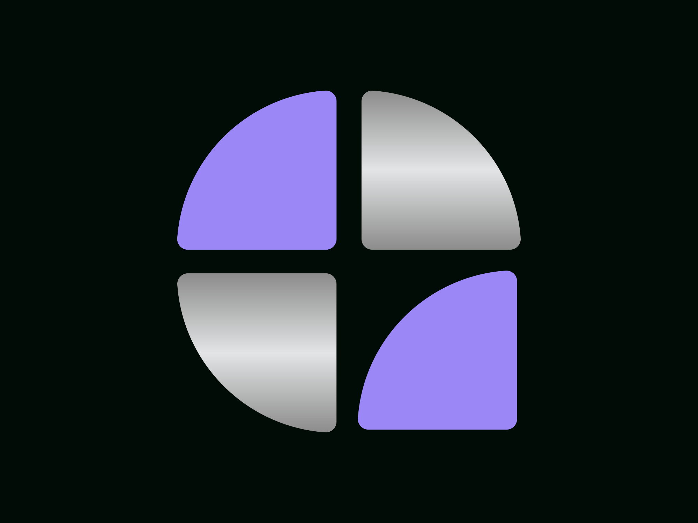

# CalC.Ai - Advanced Calculator with AI Assistance

<div align="center">
  
  <h3>Smart calculations, intelligent assistance, seamless experience</h3>
</div>

## 🌟 Overview

CalC.Ai is a modern, feature-rich calculator application that combines traditional calculation capabilities with AI-powered assistance. It offers a comprehensive suite of tools for mathematical calculations, unit conversions, AI-assisted problem solving, and interactive drawing.

## ✨ Features

### 🧮 Advanced Calculator
- **Standard & Scientific Modes**: Switch between basic and advanced calculation functions
- **Comprehensive Functions**: Trigonometry, logarithms, exponents, and more
- **Calculation History**: Track your previous calculations
- **Responsive Design**: Works seamlessly on both desktop and mobile devices

### 🔄 Unit Converter
- **Multiple Categories**: Length, area, volume, weight, temperature, and more
- **Currency Converter**: Real-time currency conversion with up-to-date exchange rates
- **Intuitive Interface**: Easy-to-use dropdown selectors and input fields
- **Instant Results**: See conversion results as you type

### 🤖 AI Math Assistant
- **Powered by Google's Gemini AI**: Utilizes Gemini 2.0 Flash for intelligent responses
- **Step-by-Step Solutions**: Get detailed explanations for complex math problems
- **Natural Language Processing**: Ask questions in plain English
- **Example Suggestions**: Quick access to common math problem templates
- **Fallback Mechanisms**: Multiple model options to ensure reliable service

### 🎨 Interactive Blackboard
- **Digital Drawing Canvas**: Sketch out problems and solutions
- **Fullscreen Mode**: Expand your workspace when needed
- **Zoom & Pan**: Navigate large drawings with ease
- **Tool Options**: Customize pen color, size, and more
- **Save & Share**: Export your work for later reference

### 👤 User Authentication
- **Secure Login**: Powered by Supabase authentication
- **User Profiles**: Personalized experience with saved preferences
- **Email Verification**: Ensure account security
- **Protected Routes**: Secure access to certain features

## 🛠️ Technology Stack

- **Frontend**: React, TypeScript, Vite
- **Styling**: Tailwind CSS, shadcn/ui
- **Animation**: Framer Motion
- **Authentication**: Supabase Auth
- **Database**: Supabase PostgreSQL
- **AI Integration**: Google Gemini API
- **State Management**: React Context API, React Query
- **Routing**: React Router

## 📱 Mobile Responsiveness

CalC.Ai is designed with a mobile-first approach, ensuring a seamless experience across all devices:
- Responsive layouts that adapt to different screen sizes
- Touch-friendly interface elements
- Bottom navigation for easy access on mobile
- Optimized input methods for touch devices

## 🚀 Getting Started

### Prerequisites
- Node.js (v16 or higher)
- npm or yarn

### Installation

```bash
# Clone the repository
git clone https://github.com/XHLEIK/cal-ai.git

# Navigate to the project directory
cd cal-ai

# Install dependencies
npm install

# Start the development server
npm run dev
```

### Environment Variables

Create a `.env.local` file in the root directory with the following variables:

```
VITE_SUPABASE_URL=your_supabase_url
VITE_SUPABASE_ANON_KEY=your_supabase_anon_key
VITE_GEMINI_API_KEY=your_gemini_api_key
```

## 🔒 Authentication

CalC.Ai uses Supabase for authentication, providing:
- Email/password authentication
- Email verification
- Password reset functionality
- Protected routes for authenticated users

## 🎨 UI/UX Features

- **Glowing Effects**: Subtle animations and glowing effects for visual appeal
- **Dark Theme**: Eye-friendly dark mode design
- **Smooth Transitions**: Animated transitions between different sections
- **Intuitive Navigation**: Easy-to-use bottom navigation bar
- **Responsive Layouts**: Adapts to different screen sizes and orientations

## 📝 License

This project is licensed under the MIT License - see the LICENSE file for details.

## 🙏 Acknowledgements

- [Supabase](https://supabase.io/) for authentication and database services
- [Google Gemini](https://ai.google.dev/) for AI capabilities
- [shadcn/ui](https://ui.shadcn.com/) for UI components
- [Tailwind CSS](https://tailwindcss.com/) for styling
- [Framer Motion](https://www.framer.com/motion/) for animations
- [React](https://reactjs.org/) and [Vite](https://vitejs.dev/) for the development framework

---

<div align="center">
  <p>Made with ❤️ by <a href="https://github.com/XHLEIK">XHLEIK</a></p>
</div>
